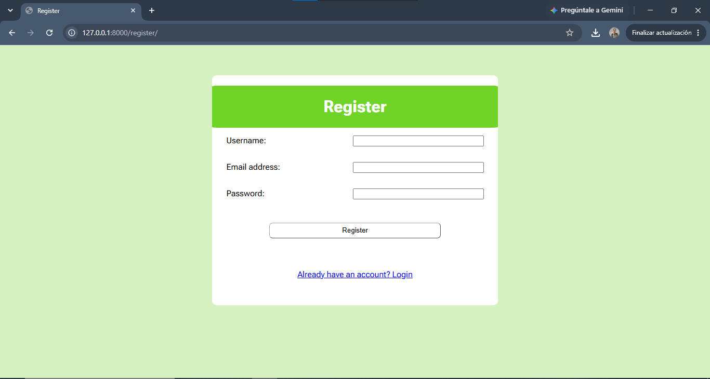

# TASK_MANAGER 📝✅

A containerized Task Management web application built with Python and Django. This project provides a complete CRUD (Create, Read, Update, Delete) interface for managing daily tasks, complete with secure user authentication.



---

## 📁 Project Structure
```text
Task-Manager/
├── Dockerfile             # Docker image configuration
├── docker-compose.yml     # Multi-container orchestration
├── manage.py              # Django command-line utility
├── requirements.txt       # Python dependencies
├── TaskManager/           # Core Django project settings
│   ├── settings.py        # Project configurations
│   ├── auth_backends.py   # Custom authentication logic
│   └── urls.py            # Main URL routing
└── tasks/                 # Main application module
    ├── models.py          # Database schema for tasks
    ├── views.py           # Controller logic for task CRUD
    ├── forms.py           # Form validation logic
    ├── templates/         # HTML views (index, addTask, edit_task, login)
    └── static/css/        # Stylesheets (stylesindex.css, stylesform.css)
```

---

## 🚀 Features & Technical Overview

The project is built on a standard MVC (Model-View-Template) architecture using Django.

### ✨ Core Functionality
- **User Authentication**: Secure login and registration system (`auth_backends.py`).
- **Task CRUD**: Users can seamlessly create, view, edit, and delete tasks.
- **Containerization**: Fully containerized using Docker and `docker-compose` for isolated, consistent environments.

### 🛠️ Tech Stack
- **Backend**: Python, Django
- **Frontend**: HTML5, CSS3
- **Infrastructure**: Docker

---

## 🚀 How to Run

### ✅ Prerequisites
Make sure you have [Docker](https://www.docker.com/) and Docker Compose installed.

### 🐳 Launch via Docker
Run the application using Docker Compose:
```bash
docker-compose up --build
```
The application will be available at `http://localhost:8000`.

### 💻 Launch Locally (Without Docker)
```bash
pip install -r requirements.txt
python manage.py migrate
python manage.py runserver
```

---

## 🔍 Additional Notes
- Static files (CSS) are isolated within the `tasks/static/` directory for modularity.
- Database migrations are tracked and stored in the `tasks/migrations/` folder.